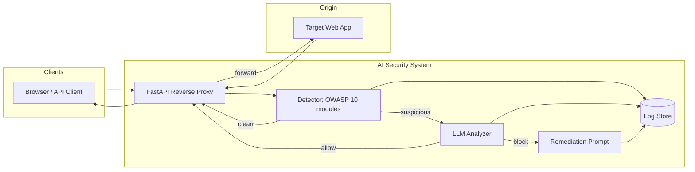

# AI Security System — 전체 계획서

> **프로젝트명:** AI Security System (GitHub: `ai-security-system`)  
> **목표:** FastAPI 기반 리버스 프록시 WAF와 로컬 LLM(Mistral-7B)을 결합하여, 웹 요청을 실시간으로 탐지·차단하고 OWASP 관점의 보안 개선(리미디에이션)을 제안하는 시스템을 구축한다.

---

## 1. 배경 및 비전

### 1.1 문제 정의

- 전통 WAF는 시그니처 위주로 빠르지만 오탐·미탐과 유지보수 부담이 있다.
- 개발 단계에서 취약한 코드를 바로 고치도록 돕는 **보안 코딩 어시스턴트**가 있으면 사고 예방에 유리하다.

### 1.2 비전

클라이언트 → **AI Security System(프록시)** → **타겟 애플리케이션** 경로에서:

1. **1차:** 규칙·정규식·시그니처로 저지연 필터링  
2. **2차:** 의심 구간만 LLM에 문맥 분석 요청  
3. **차단 시:** 공격 유형·근거와 함께 **패치 지향 가이드·코드 스니펫** 생성  
4. **운영:** 탐지 로그·통계·제안 내역을 API·웹 UI로 조회

---

## 2. 범위

### 2.1 포함 (In Scope)

| 영역 | 내용 |
|------|------|
| 리버스 프록시 | FastAPI + `httpx` 비동기 업스트림 전달, 헤더·바디·쿼리 검사 훅 |
| OWASP 탐지 | **OWASP Top 10(2021) 항목별 독립 모듈 10개** — 요청/응답 메타데이터·패턴·휴리스틱·(필요 시) LLM 보조 |
| AI 파이프라인 | LangChain 등으로 OpenAI 호환 로컬 엔드포인트(Mistral-7B) 연동 |
| 리미디에이션 | 차단/고위험 이벤트 시 프롬프트 템플릿 기반 개선안 생성 |
| 관측성 | SQLite 또는 Redis에 이벤트 저장, 블랙리스트·율리밋 확장 여지 |
| 대시보드 | REST API + 기본 웹 UI(로그, OWASP 분류, 차단율, AI 제안 요약) |

### 2.2 제외 또는 후순위 (Out of Scope / Later)

- 상용 클라우드 WAF 수준의 글로벌 PoP·DDoS 흡수  
- 완전 자동 패치 적용(CI까지 무인 머지) — **제안·가이드**까지가 1차 목표  
- 각 모듈의 탐지 **깊이**는 동일하지 않을 수 있음 — 프록시 관측 가능 범위 안에서 우선순위·정밀도 조정  

---

## 3. 시스템 아키텍처

### 3.1 논리 구성



### 3.2 요청 처리 흐름 (요약)

1. 클라이언트가 WAF의 호스트·포트로 요청  
2. **검사 대상 추출:** 경로, 쿼리스트링, 주요 헤더(Cookie, Authorization 등), 바디(크기·타입 제한)  
3. **1차 탐지:** OWASP Top 10 대응 **10개 모듈**을 파이프라인 순서로 호출(병렬/단축 평가는 구현에서 최적화)  
4. **2차 탐지(옵션/샘플링):** 임계치·정책에 따라 LLM 호출  
5. **판정:** 허용 → 업스트림으로 프록시 / 차단 → HTTP 응답(403 등) + 필요 시 리미디에이션 JSON  
6. **기록:** 이벤트·판정·지연시간·OWASP 태그(복수 가능) 저장  

### 3.3 리버스 프록시 구현 원칙

- **Hop-by-hop 헤더** 제거·재구성(Connection, Keep-Alive 등)  
- **스트리밍·대용량 바디:** 메모리 상한, 타임아웃, 최대 바디 크기 정책  
- **WebSocket:** 졸업작품 범위에서는 1차는 HTTP 위주, WebSocket은 명시적 후속 과제로 문서화  

---

## 4. OWASP Top 10 모듈 (10개)

탐지 레이어는 **OWASP Top 10 (2021)** 각 항목에 1:1로 대응하는 **모듈 10개**로 구성한다. 코드에서는 `owasp/a01.py` ~ `owasp/a10.py`(또는 동일 역할의 패키지)로 분리하는 것을 목표로 한다.

| 모듈 | ID | 항목 (영문) | 탐지·대응 초점 (프록시/요청 관측 관점) |
|------|-----|-------------|----------------------------------------|
| 1 | **A01** | Broken Access Control | 경로 순회(`../`), 직접 객체 참조 후보(URL 패턴), 관리/내부 경로 노출, HTTP 메서드 남용(예: DELETE/PUT 허용 범위) |
| 2 | **A02** | Cryptographic Failures | 민감 파라미터 평문 전송 유도 여부, `Set-Cookie`의 `Secure`/`HttpOnly`/`SameSite` 누락(업스트림 **응답** 관측 시), HTTPS 강제 관련 리다이렉트 헤더 힌트 |
| 3 | **A03** | Injection | SQLi·NoSQLi·커맨드 인젝션·LDAP/XPath 등 **페이로드 시그니처**, 인코딩 우회, 파라미터 폭주 |
| 4 | **A04** | Insecure Design | 비즈니스 로직 우회 시그널(가격·수량·역할 파라미터 조작 패턴), 과도한 일괄 처리·스킵 토큰 등 휴리스틱 |
| 5 | **A05** | Security Misconfiguration | 디버그/스택트레이스 노출 힌트(응답 헤더·에러 본문 키워드), 기본 경로·백업 파일 패턴(`.env`, `.git`, `server-status` 등) |
| 6 | **A06** | Vulnerable and Outdated Components | `Server`·`X-Powered-By` 노출, 알려진 취약 버전 지문(헤더·오류 페이지), 의심스러운 플러그인 경로 |
| 7 | **A07** | Identification and Authentication Failures | 로그인 엔드포인트 집중 공격, 세션·토큰 패턴 이상, 브루트포스·크리덴셜 스터핑 **율·시그니처**, 취약 쿠키 설정 |
| 8 | **A08** | Software and Data Integrity Failures | 서명되지 않은 Webhook/콜백 조작 패턴, CI/CD·업데이트 URL 조작 시도, 무결성 검증 생략 징후(헤더/바디 힌트) |
| 9 | **A09** | Security Logging and Monitoring Failures | WAF 자체 **감사 로그** 품질(누락 이벤트), 침묵 실패(동일 공격 반복 시 알림 훅), 모니터링용 메트릭 export |
| 10 | **A10** | Server-Side Request Forgery (SSRF) | 내부 IP·메타데이터 URL·`file://`·클라우드 메타데이터 호스트로의 **아웃바운드 URL** 패턴(바디/쿼리) |

### 4.1 모듈별 구현 메모

- **A01 / A04 / A07:** 문맥(세션·권한)이 필요한 경우가 많아, 1차는 **패턴·휴리스틱**, 2차는 **LLM 보조 분류**로 오탐을 줄인다.  
- **A02 / A05 / A06:** 업스트림 **응답**을 일부 저장·스캔할 수 있을 때 효과가 크다(메모리·PII 마스킹 정책 필수).  
- **A09:** 다른 모듈의 “탐지”라기보다 **플랫폼 로깅·알림·대시보드 연동** 모듈로 설계해, 감사 추적과 운영 가시성을 담당한다.  
- **A10:** 프록시가 **클라이언트→오리진** 요청만 볼 때는 “앱이 외부 URL을 fetch”하는 본문/파라미터를 중심으로 탐지한다.  

### 4.2 공통 판정 정책 (정책 매트릭스)

| 단계 | 조건 | 동작 |
|------|------|------|
| L1 | 시그니처 명백 일치 | 즉시 차단 또는 격리 응답 |
| L2 | 애매 일치 | LLM 분석 큐 |
| L3 | LLM 고신뢰 악성 | 차단 + 리미디에이션 |
| L4 | LLM 애매 | 로그만 또는 관대 통과(환경 변수로 조정) |

---

## 5. AI 분석 엔진

### 5.1 연동 방식

- **로컬 OpenAI 호환 API** (예: Ollama, LM Studio, vLLM) + `MISTRAL_MODEL`  
- LangChain으로 프롬프트·출력 파싱(구조화 JSON 권장)

### 5.2 프롬프트 전략

- **분류용:** 요청 발췌(마스킹) + OWASP 후보 + “악성/정상/불확실” + 짧은 근거  
- **리미디에이션용:** 별도 시스템·유저 메시지 템플릿(이미 설계 방향 존재) — 한국어 설명 + 패치 스니펫

### 5.3 운영 파라미터

- 타임아웃, 동시 LLM 호출 상한, 큐 길이  
- **오탐 완화:** 학습/데모 환경에서는 `WAF_LLM_CONFIRM` 등으로 2차 분석 on/off  

### 5.4 macOS / 하드웨어

- Mistral 추론은 **GPU(MPS)** 또는 CPU는 실행 환경에 따름 — WAF 프로세스와 **추론 서버 분리** 권장(안정적 지연 분리)

---

## 6. 데이터 저장

| 용도 | 1차 선택 | 비고 |
|------|----------|------|
| 이벤트 로그 | SQLite | 단일 파일, 졸업작품·로컬 데모에 적합 |
| 블랙리스트·율리밋 | Redis(선택) | 다중 인스턴스·TTL 필요 시 |

**스키마(초안):** 타임스탬프, 클라이언트 IP(해시 가능), 메서드, 경로, **OWASP 태그(복수, A01–A10)**, 판정, 규칙 ID, LLM 사용 여부, 지연(ms), 리미디에이션 요약(텍스트)

---

## 7. 대시보드 · API

### 7.1 API (예시 엔드포인트)

- `GET /api/dashboard/summary` — 기간별 차단/허용, **OWASP 10 모듈별** 분포  
- `GET /api/events` — 페이지네이션 필터(태그, 판정)  
- `GET /api/events/{id}` — 상세 + 리미디에이션 본문  
- `GET /health` — WAF·업스트림·LLM 가용성(선택)

### 7.2 웹 UI

- 정적 HTML + 최소 JS 또는 FastAPI `Jinja2` 템플릿  
- 화면: 최근 이벤트 테이블, **OWASP 10 항목별** 차트, 차단율 KPI, AI 제안 카드  

---

## 8. 보안·윤리·법적 주의

- **본인 소유 또는 허가된 테스트 환경**에서만 운영; 타인 서비스에 대한 무단 트래픽 중간참여는 불법 소지  
- 로그에 **개인정보·비밀번호·토큰** 저장 금지 — 마스킹·최소 수집  
- LLM 출력은 **참고용** — 자동 차단 정책은 시그니처와 결합해 오탐 대비  

---

## 9. 기술 스택 정리

| 계층 | 기술 |
|------|------|
| API / 프록시 | FastAPI, Uvicorn |
| 업스트림 호출 | httpx (async) |
| AI | LangChain, OpenAI 호환 클라이언트, Mistral-7B(로컬) |
| 저장소 | SQLite(필수), Redis(선택) |
| 환경 | Python 3.11+, macOS, `.env` 설정 |

---

## 10. 디렉터리 구조 (목표)

```text
ai-security-system/
  main.py                 # FastAPI 앱 진입, 프록시 라우팅
  detector.py             # 10개 모듈 오케스트레이션, 2차 LLM 호출 조율
  proxy/                  # 업스트림 전달, 헤더 처리 (선택 분리)
  owasp/
    a01.py … a10.py       # OWASP Top 10 항목별 모듈 (각 1파일)
    __init__.py
  prompts/                # 리미디에이션·분류 프롬프트
  storage/                # DB 모델, 리포지토리
  api/                    # 대시보드 라우터
  static/ / templates/    # 웹 UI
  tests/                  # 단위·통합 테스트
  requirements.txt
  .env.example
  PLAN.md
  README.md
```

(실제 구현 단계에서 파일이 늘거나 합쳐질 수 있음.)

---

## 11. 검증·데모 시나리오

1. 정상 GET/POST — 통과 및 지연 측정  
2. 전형적 SQLi 쿼리 — **A03** 태그 및 차단  
3. 경로 순회 시도 — **A01** 태그 및 로그  
4. 반복 로그인 실패 — **A07** / 율리밋(구현 시)  
5. 내부 메타데이터 URL 시도 — **A10** 태그  
6. 대시보드에서 **10개 모듈별** 분포·차단율 반영 확인  

---

## 12. 성공 기준 (졸업작품 관점)

- [ ] 클라이언트 → WAF → 타겟으로 **실제 HTTP 트래픽**이 프록시된다.  
- [ ] OWASP Top 10에 대응하는 **모듈 10개**가 코드 구조상 분리·호출 가능하다.  
- [ ] 대표 시나리오(A03 등)에서 **자동 탐지**가 동작하고, 이벤트가 **DB에 기록**된다.  
- [ ] 의심 요청에 대해 **LLM 기반 2차 판정**이 호출될 수 있다.  
- [ ] 차단/고위험 시 **개선 가이드(텍스트·코드 스니펫)** 가 생성·조회된다.  
- [ ] **API + 웹 UI**로 통계·로그를 확인할 수 있다.  
- [ ] 코드·실행 방법이 README에 정리되어 재현 가능하다.  

---

## 13. 변경 이력

| 날짜 | 내용 |
|------|------|
| 2025-03-24 | 초안 작성 — 요구사항·아키텍처 통합 |
| 2025-03-24 | OWASP Top 10 기준 **모듈 10개**로 재구성, 단계별 로드맵 제거 |

---

*본 문서는 구현 진행에 따라 버전을 올리며 업데이트한다.*
