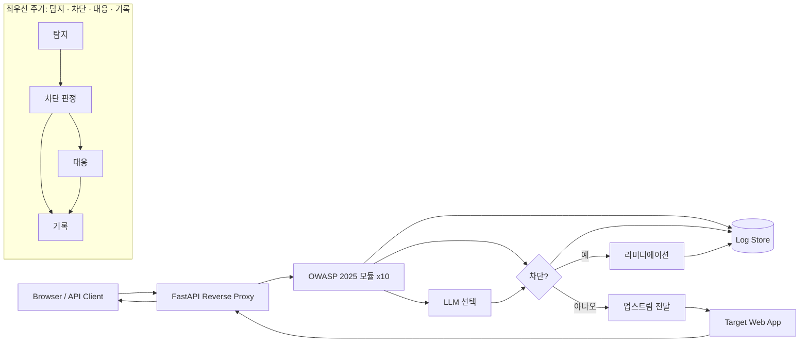

# AI Security System — 전체 계획서

> **프로젝트명:** AI Security System (GitHub: `ai-security-system`)  
> **목표:** FastAPI 기반 리버스 프록시 WAF와 로컬 LLM(Mistral-7B)을 결합하여, 웹 요청에 대해 **탐지·차단·대응·기록**의 순환을 최우선으로 수행하고, [OWASP Top 10:2025](https://owasp.org/Top10/2025/) 관점의 보안 개선(리미디에이션)을 제안한다.

---

## 1. 배경 및 비전

### 1.1 문제 정의

- 전통 WAF는 시그니처 위주로 빠르지만 오탐·미탐과 유지보수 부담이 있다.
- 개발 단계에서 취약한 코드를 바로 고치도록 돕는 **보안 코딩 어시스턴트**가 있으면 사고 예방에 유리하다.

### 1.2 비전

클라이언트 → **AI Security System(프록시)** → **타겟 애플리케이션** 경로에서:

1. **1차:** 규칙·정규식·시그니처로 저지연 필터링  
2. **2차:** 의심 구간만 LLM에 문맥 분석 요청  
3. **차단 시:** 공격 유형·근거와 함께 **패치 지향 가이드·코드 스니펫** 생성  
4. **운영:** 탐지 로그·통계·제안 내역을 API·웹 UI로 조회  

위 흐름은 아래 **1.3 네 가지 축**으로 정리해 구현 우선순위를 둔다.

### 1.3 최우선 원칙: 탐지 · 차단 · 대응 · 기록

모든 기능 설계·구현은 다음 **운영 주기**를 중심에 둔다. (OWASP 모듈·AI·대시보드는 이 주기를 지원하는 수단이다.)

| 축 | 의미 | 시스템에서의 역할 (요약) |
|----|------|---------------------------|
| **탐지** | 위협·정책 위반 식별 | 요청/응답 스캔, OWASP **Top 10:2025** 모듈 10개, 시그니처, (선택) LLM 2차 판정 |
| **차단** | 플로우 중단·격리 | 정책에 따른 거부 응답(403 등), 업스트림 미전달, (선택) 세션·IP 율리밋·블랙리스트 |
| **대응** | 사건 이후 조치·완화 | 리미디에이션(가이드·코드 제안), 알림 훅, 운영자가 재현 가능한 컨텍스트 제공 |
| **기록** | 감사·분석 가능한 로그 | 판정 근거, OWASP 태그, 타임라인, 대시보드/API 조회, **누락 없는 이벤트 저장**이 목표 |

**구현 시 체크:** 탐지 결과가 있으면 반드시 **기록**되고, 차단 여부는 정책으로 명시하며, 차단·고위험에는 **대응**(제안/알림) 산출물이 연계되도록 파이프라인을 설계한다.

---

## 2. 범위

### 2.1 포함 (In Scope)

| 영역 | 내용 |
|------|------|
| 리버스 프록시 | FastAPI + `httpx` 비동기 업스트림 전달, 헤더·바디·쿼리 검사 훅 |
| 핵심 주기 | **탐지 → (정책) 차단/허용 → 대응 산출 → 기록** 일관 파이프라인 |
| OWASP 탐지 | **[OWASP Top 10:2025](https://owasp.org/Top10/2025/)** 항목별 독립 모듈 10개 — 요청/응답 메타데이터·패턴·휴리스틱·(필요 시) LLM 보조 |
| AI 파이프라인 | LangChain 등으로 OpenAI 호환 로컬 엔드포인트(Mistral-7B) 연동 |
| 리미디에이션 | 차단/고위험 이벤트 시 프롬프트 템플릿 기반 개선안 생성 (**대응** 축) |
| 관측성 | SQLite 또는 Redis에 이벤트 저장, 블랙리스트·율리밋 확장 여지 (**기록**·차단 보조) |
| 대시보드 | REST API + 기본 웹 UI — 탐지·차단·대응·기록 지표(로그, OWASP 분류, 차단율, AI 제안) |

### 2.2 제외 또는 후순위 (Out of Scope / Later)

- 상용 클라우드 WAF 수준의 글로벌 PoP·DDoS 흡수  
- 완전 자동 패치 적용(CI까지 무인 머지) — **제안·가이드**까지가 1차 목표  
- 각 모듈의 탐지 **깊이**는 동일하지 않을 수 있음 — 프록시 관측 가능 범위 안에서 우선순위·정밀도 조정  

---

## 3. 시스템 아키텍처

### 3.1 논리 구성



### 3.2 요청 처리 흐름 (탐지·차단·대응·기록 중심)

1. 클라이언트가 WAF의 호스트·포트로 요청한다.  
2. **검사 대상 추출:** 경로, 쿼리스트링, 주요 헤더, 바디(크기·타입 제한).  
3. **탐지:** OWASP Top 10:**2025** 대응 **10개 모듈**로 평가(병렬/단축 최적화 가능). 필요 시 LLM으로 2차 판정.  
4. **차단 판정:** 정책(L1–L4 등)에 따라 업스트림 **미전달** 및 HTTP 오류 응답, 또는 통과.  
5. **대응:** 차단·고위험 시 리미디에이션 텍스트 생성, (선택) 알림; 허용이어도 **경고성 탐지**는 기록·대응 정책에 따름.  
6. **기록:** 탐지 결과·차단 여부·대응 산출 요약·지연·OWASP 태그를 **누락 없이** 저장하고 대시보드/API로 조회 가능하게 한다.  

### 3.3 리버스 프록시 구현 원칙

- **Hop-by-hop 헤더** 제거·재구성(Connection, Keep-Alive 등)  
- **스트리밍·대용량 바디:** 메모리 상한, 타임아웃, 최대 바디 크기 정책  
- **WebSocket:** 졸업작품 범위에서는 1차는 HTTP 위주, WebSocket은 명시적 후속 과제로 문서화  

---

## 4. OWASP Top 10:2025 모듈 (10개)

탐지 레이어는 **OWASP Top 10:2025** 각 항목에 1:1 대응하는 **모듈 10개**로 구성한다. 코드에서는 `owasp/a01.py` ~ `owasp/a10.py`(또는 동일 역할의 패키지)로 분리하는 것을 목표로 한다. 공식 목록: [owasp.org/Top10/2025](https://owasp.org/Top10/2025/).

| 모듈 | ID | 항목 (영문) | 탐지·차단·대응·기록 초점 (프록시 관측 관점) |
|------|-----|-------------|---------------------------------------------|
| 1 | **A01:2025** | Broken Access Control | 경로 순회, IDOR 후보 URL, 관리·내부 경로, 메서드 남용; **기록**에 주체·리소스 힌트 |
| 2 | **A02:2025** | Security Misconfiguration | 디버그·백업·`.env`·`.git` 노출, 위험 헤더, 기본 설치 경로; 응답 스캔 시 스택·버전 노출 |
| 3 | **A03:2025** | Software Supply Chain Failures | 서드파티 스크립트·패키지 CDN URL 이상, 타도메인 리소스 조작 시도, 의심 의존성 경로(휴리스틱) |
| 4 | **A04:2025** | Cryptographic Failures | 민감 파라미터 평문, 취약 `Set-Cookie`(Secure/HttpOnly/SameSite), HTTPS 강제·리다이렉트 힌트 |
| 5 | **A05:2025** | Injection | SQLi·NoSQLi·커맨드·LDAP/XPath 등 페이로드, 인코딩 우회; **차단** 시 **대응** 스니펫 연계 |
| 6 | **A06:2025** | Insecure Design | 비즈니스 로직 우회 패턴(가격·역할·한도 파라미터), 일괄 처리·우회 토큰 휴리스틱 |
| 7 | **A07:2025** | Authentication Failures | 로그인 집중 공격, 브루트포스·크리덴셜 스터핑, 세션·JWT 패턴 이상, 취약 쿠키 |
| 8 | **A08:2025** | Software or Data Integrity Failures | 무결성 검증 생략 징후, 조작된 Webhook/콜백, 서명 없는 업데이트·다운로드 URL 패턴 |
| 9 | **A09:2025** | Security Logging and Alerting Failures | WAF **기록** 완전성(누락 감지), 동일 공격 반복 **알림** 훅, 감사 추적 필드 표준화 |
| 10 | **A10:2025** | Mishandling of Exceptional Conditions | 과도한 에러 상세·스택 노출(응답 스캔), 에러 기반 정보 유출, 비정상 상태 코드 패턴 |

### 4.1 모듈별 구현 메모

- **A01 / A06 / A07:** 문맥 의존도가 높아 1차 **휴리스틱**, 2차 **LLM**으로 보조하고, **기록**에 재현 맥락을 남긴다.  
- **A02 / A04 / A10:** 업스트림 **응답** 스캔이 효과적 — PII 마스킹·버퍼 상한 필수.  
- **A03:** 프록시만으로는 한계가 있어 **요청 내 외부 리소스·스크립트 URL** 중심으로 1차 탐지하고, **기록**으로 공급망 이슈 추적을 돕는다.  
- **A09:** “탐지 모듈”이면서 동시에 **기록·알림 품질**을 강제하는 메타 레이어로 설계한다(다른 모듈 이벤트 누락 방지).  

### 4.2 공통 판정 정책 (정책 매트릭스)

| 단계 | 조건 | 동작 |
|------|------|------|
| L1 | 시그니처 명백 일치 | **차단** + **기록** + (정책 시) **대응** |
| L2 | 애매 일치 | LLM **탐지** 보조 → 판정 후 차단/허용 + **기록** |
| L3 | LLM 고신뢰 악성 | **차단** + **대응**(리미디에이션) + **기록** |
| L4 | LLM 애매 | 허용 또는 관대 통과 + **기록**(경고) — 환경 변수로 조정 |

---

## 5. AI 분석 엔진

### 5.1 연동 방식

- **로컬 OpenAI 호환 API** (예: Ollama, LM Studio, vLLM) + `MISTRAL_MODEL`  
- LangChain으로 프롬프트·출력 파싱(구조화 JSON 권장)

### 5.2 프롬프트 전략

- **분류용:** 요청 발췌(마스킹) + OWASP **2025** 후보 + “악성/정상/불확실” + 짧은 근거  
- **리미디에이션용:** 별도 시스템·유저 메시지 템플릿 — 한국어 설명 + 패치 스니펫 (**대응** 축)

### 5.3 운영 파라미터

- 타임아웃, 동시 LLM 호출 상한, 큐 길이  
- **오탐 완화:** 학습/데모 환경에서는 `WAF_LLM_CONFIRM` 등으로 2차 분석 on/off  

### 5.4 macOS / 하드웨어

- Mistral 추론은 **GPU(MPS)** 또는 CPU는 실행 환경에 따름 — WAF 프로세스와 **추론 서버 분리** 권장(안정적 지연 분리)

---

## 6. 데이터 저장 (기록)

| 용도 | 1차 선택 | 비고 |
|------|----------|------|
| 이벤트 로그 | SQLite | 단일 파일, 졸업작품·로컬 데모에 적합 |
| 블랙리스트·율리밋 | Redis(선택) | 다중 인스턴스·TTL 필요 시 |

**스키마(초안):** 타임스탬프, 클라이언트 IP(해시 가능), 메서드, 경로, **OWASP 태그(복수, A01:2025–A10:2025 코드)**, **탐지** 근칙 ID, **차단** 여부, **대응** 요약(리미디에이션·알림 여부), LLM 사용 여부, 지연(ms)  

**기록 원칙:** 탐지가 발생한 모든 유의미한 이벤트는 정책에 따라 최소 한 줄 이상의 감사 레코드로 남긴다.

---

## 7. 대시보드 · API

### 7.1 API (예시 엔드포인트)

- `GET /api/dashboard/summary` — **탐지/차단/대응(제안)/기록** 건수, OWASP 2025 모듈별 분포  
- `GET /api/events` — 페이지네이션 필터(태그, 차단 여부)  
- `GET /api/events/{id}` — 상세 + 리미디에이션 본문  
- `GET /health` — WAF·업스트림·LLM 가용성(선택)

### 7.2 웹 UI

- 정적 HTML + 최소 JS 또는 FastAPI `Jinja2` 템플릿  
- 화면: 최근 이벤트, **탐지→차단→대응** 흐름이 보이는 테이블, OWASP **2025** 10항목 차트, 차단율 KPI, AI 제안 카드  

---

## 8. 보안·윤리·법적 주의

- **본인 소유 또는 허가된 테스트 환경**에서만 운영; 타인 서비스에 대한 무단 트래픽 중간참여는 불법 소지  
- 로그에 **개인정보·비밀번호·토큰** 저장 금지 — 마스킹·최소 수집  
- LLM 출력은 **참고용** — 자동 차단 정책은 시그니처와 결합해 오탐 대비  

---

## 9. 기술 스택 정리

| 계층 | 기술 |
|------|------|
| API / 프록시 | FastAPI, Uvicorn |
| 업스트림 호출 | httpx (async) |
| AI | LangChain, OpenAI 호환 클라이언트, Mistral-7B(로컬) |
| 저장소 | SQLite(필수), Redis(선택) |
| 환경 | Python 3.11+, macOS, `.env` 설정 |

---

## 10. 디렉터리 구조 (목표)

```text
ai-security-system/
  main.py                 # FastAPI 앱 진입, 프록시 라우팅
  detector.py             # 10개 모듈 오케스트레이션, 탐지·차단·대응·기록 파이프라인
  proxy/                  # 업스트림 전달, 헤더 처리 (선택 분리)
  owasp/
    a01.py … a10.py       # OWASP Top 10:2025 항목별 모듈 (각 1파일)
    __init__.py
  prompts/                # 리미디에이션·분류 프롬프트
  storage/                # DB 모델, 리포지토리
  api/                    # 대시보드 라우터
  static/ / templates/    # 웹 UI
  verification/           # 자동 검증 스위트 (pytest)
  docs/                   # 마크다운 문서 (PLAN, 네트워크 가이드 등)
  requirements.txt
  .env.example
  README.md
```

(실제 구현 단계에서 파일이 늘거나 합쳐질 수 있음.)

---

## 11. 검증·데모 시나리오

1. 정상 GET/POST — 통과, **기록**(허용) 및 지연 측정  
2. 전형적 SQLi — **A05:2025** 태그, **차단**, **대응** 제안·**기록**  
3. 경로 순회 — **A01:2025** 태그 및 **기록**  
4. 반복 로그인 실패 — **A07:2025** / 율리밋·**기록**  
5. 과도한 에러 본문 노출(모의 응답) — **A10:2025** 태그  
6. 대시보드에서 **탐지·차단·대응·기록** 지표와 **2025** 10모듈 분포 확인  

---

## 12. 성공 기준

구현 순서·다음 작업 묶음은 [IMPLEMENTATION_ROADMAP.md](./IMPLEMENTATION_ROADMAP.md)를 본다.

- [ ] **탐지·차단·대응·기록**이 하나의 요청 파이프라인에서 설명 가능하고 동작한다.  
- [ ] 클라이언트 → WAF → 타겟으로 **실제 HTTP 트래픽**이 프록시된다.  
- [ ] OWASP Top 10:**2025**에 대응하는 **모듈 10개**가 코드 구조상 분리·호출 가능하다.  
- [ ] 대표 시나리오에서 **자동 탐지**·**차단 정책**·**기록**이 동작한다.  
- [ ] 의심 요청에 대해 **LLM 기반 2차 탐지**가 호출될 수 있다.  
- [ ] 차단/고위험 시 **대응**(개선 가이드·코드 스니펫)이 생성·조회된다.  
- [ ] **API + 웹 UI**로 통계·로그를 확인할 수 있다.  
- [ ] 코드·실행 방법이 README에 정리되어 재현 가능하다.  

---

## 13. 변경 이력

| 날짜 | 내용 |
|------|------|
| 2025-03-24 | 초안 작성 — 요구사항·아키텍처 통합 |
| 2025-03-24 | OWASP Top 10 기준 **모듈 10개**로 재구성, 단계별 로드맵 제거 |
| 2025-03-24 | **탐지·차단·대응·기록**을 최우선 원칙으로 명시; OWASP **Top 10:2025**로 전환 |
| 2026-03-26 | §12에 [IMPLEMENTATION_ROADMAP.md](./IMPLEMENTATION_ROADMAP.md) 링크 추가 |

---

*본 문서는 구현 진행에 따라 버전을 올리며 업데이트한다. OWASP 분류는 [Top 10:2025](https://owasp.org/Top10/2025/) 공식 문서를 기준으로 한다.*
